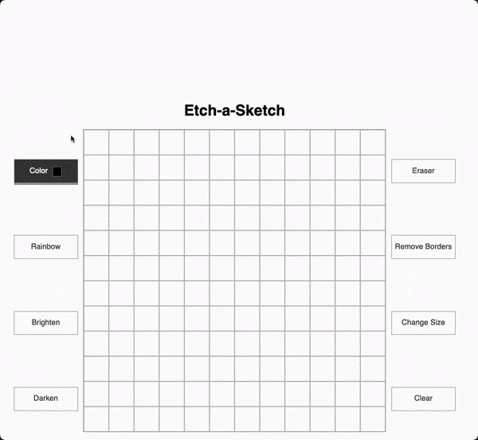

# Etch-a-Sketch!
A live implementation of the project can be found at this [GitHub Pages link](https://emannuelmartineztest.github.io/etch-a-sketch/).

## Initial goals
While an etch-a-sketch application isn't hard to implement on its own, it's all the added functionality asked of 
us that made this a fun and worth-while project to try and work out. 

Specifically, we were supposed to:
- Create an interactive and dynamic drawing application, which included the following features:
    - Multi-color pen
    - Rainbow pen
    - Highlighter 
    - Shader
    - Eraser
    - "Pixel" width setter
    - Border remover
- Efficiently optimize DOM operations to prevent browser slow-down
  - Necessary as we, on the extreme end, have to listen to and handle requests from 10,000 'pixels' within a small pixel area.

## Design Choices and Optimizations
### Radio Buttons vs Normal Buttons
With each new project, I want to challenge myself and try and implement ideas that I think are worthwhile to learn, but 
also semantically accurate. 

So for this project, I decided that instead of using simple buttons to handle which mode the user was in, I used radio 
buttons instead. Radio buttons are useful as they inherently only allow for one button to be selected at a time within
a group. 

### Dynamic Drawing Area
An issue I ran into quite early on had to do with rendering, specifically with how `.js` handles floating-point numbers
and sub-pixel rendering. 

One of the initial requirements given to us was that the pixels we rendered for the drawing area had to fit
within the initially defined container parameters. But as mentioned before, because floating point division isn't exact,
there would have to be concessions made to the quality of the drawing area to fit all the items as necessary. We either
render exactly as is, but partially obscure one or more sides of the container to make it appear they 
fit-in seamlessly, or we just jam all the pictures within the container leading to non-uniform pixel rendering.

I decided that a uniform drawing area was more important from a visual standpoint, and that I would simply just 
forego the constraints and resize the pixel container itself. I would try and keep it as close to the original size 
as possible, and I think I was able to do just that.

### Document Fragments
One issue that I was having with the rendering itself was when it came to appending all the items to the actual container. 

So I read about `DOM reflow`, and learned that everytime I added something to the page that was 'live', it would basically
have to redraw the page every single time at a per-item basis. And when I'm having to reflow sometimes up to 10,000 times
per full redraw...I needed to come up with a more effective solution.

This is when I learned about the concept of a `virtual DOM`, which is just a DOM that exists in memory and behave just like
a normal `DOM` element would, but the key difference is that it won't trigger a reflow after each new item is added!
I implemented this using a document fragment, added my items to the fragment first, and once I was done, would add
the fragment to my actual `DOM`. 

This greatly improved the efficiency of my application, as I was now no longer wasting precious resources on costly
DOM operations!

### Handling Event Listeners
Adding event listeners directly to each of the divs would have grinded the page down to a crashing halt. So instead,
I would add event listeners to parent-descendents as far away as possible and then just use the returned `evt.target`
to then do whatever manipulation I needed. 

